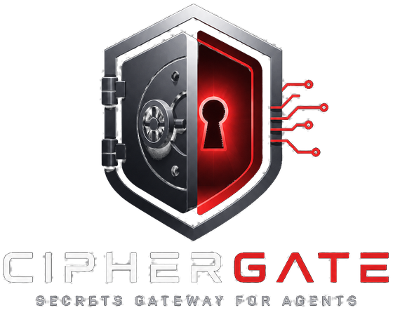

# CipherGate



[](https://github.com/maverick0628/ciphergate/actions/workflows/ci.yml)
[](LICENSE)
[](package.json)
[](docs/mcp-http-transport.md)
[](package.json)

**A self-hosted secrets manager with one core and three surfaces — REST, CLI and
MCP — plus a proxy that hands credentials to AI agents without ever letting them
hold one.**

Built for a single node you control. It replaces scattered `.env` files with a
store where every secret is AES-256-GCM encrypted at rest, scoped to named
consumers, and audit-logged on every read. Self-hosted, Docker-deployable, SQLite
underneath, no cloud dependency.

If you have wired Claude Code, Cursor or another MCP client to real
infrastructure, you have probably noticed your API keys sitting in plaintext in a
JSON config file. That is the problem this exists to fix.

> Published as a reference implementation, not a product. It is a single-node
> store with no HA, clustering, dynamic secrets, PKI or SSO. If you need those,
> use [Vault](https://www.hashicorp.com/products/vault) or
> [OpenBao](https://openbao.org/). What is here is a small, legible codebase that
> does one thing carefully.

## What makes it interesting

Most credential tooling for agents proxies secrets. This also **polices what the
agent does with them**. `gateway-proxy guard` sits in the JSON-RPC stream between
an MCP client and a downstream server, enforcing a per-server policy: a tool
allowlist, argument filtering, and response redaction. A trading server can be
allowed to read quotes and denied the ability to place an order, and the denial is
enforced at the wire, not by asking the model nicely.

The browser UI is the other half of the idea. It can add and edit every secret in
the store, and it **never displays one**. No endpoint behind it returns plaintext
— the detail view shows `sk-l...c9ae` and nothing more — so a stolen session
yields metadata and eight characters. Editing tags or consumers cannot touch a
stored value, because the write path is a genuine partial update rather than an
upsert.

## Who it is for

Someone running services on hardware they own — a homelab, a VPS, a single
production box — who has outgrown `.env` files but does not want to operate
Vault. Particularly if some of those consumers are AI agents, because that is
where the design does something other tools do not.

If you need high availability, dynamic secrets, PKI or SSO, this is the wrong
tool and the comparison below says so plainly.

## How it compares

| | CipherGate | Vault / OpenBao | Infisical / Doppler | `.env` files |
|---|---|---|---|---|
| Runs on your hardware | yes | yes | self-host tier | yes |
| Operational weight | one container | unsealing, HA, policies | SaaS account | none |
| Encrypted at rest | AES-256-GCM | yes | yes | **no** |
| Per-consumer scoping | yes | yes | yes | no |
| Audit log | every read | yes | yes | no |
| MCP server built in | **yes** | no | no | — |
| Policy enforcement for agents | **yes** | no | no | — |
| High availability | **no** | yes | yes | — |
| Dynamic secrets, PKI, SSO | **no** | yes | partial | — |

The honest summary: Vault and OpenBao are more capable and considerably more
work. Infisical and Doppler are easier but put your secrets on someone else's
infrastructure. CipherGate sits in the gap — one container, no cloud account,
and a codebase small enough to actually read.

The MCP and agent-policy rows are the ones without a real competitor today.

## Architecture

- **REST API** — Fastify on `:8400`. Consumer-scoped bearer keys, per-endpoint
  rate limits, per-IP lockout, in-process cache with TTL.
- **CLI** — `gateway`, for init, consumers, secrets, env output, backup, restore
  and import. Works against a local database or a remote gateway.
- **MCP server** — stdio *and* streamable-http, four tools: `get_secret`,
  `list_secrets`, `get_env`, `rotation_report`.
- **Scoped-injector proxy** — `gateway-proxy` launches downstream MCP servers
  with credentials injected at runtime, so they never store keys and every read
  is audited. `gateway-proxy guard` adds policy enforcement.
- **Browser UI** — its own listener on `:8405`, its own credential, TLS by
  default. Add, edit, search, rotate. Never reveals, never deletes.
- **Watchdog** — `gateway-watchdog` probes HTTP and TCP targets and alerts on
  *state transition* rather than every tick.
- **Backup** — `gateway-backup`, encrypted archives with retention.
- **Storage** — SQLite with AES-256-GCM column encryption; the data key is
  derived from a keyfile with Argon2id.

Five runtime dependencies, deliberately: Fastify, better-sqlite3, argon2,
commander, and the MCP SDK.

## Quick start

```bash
npm install
npm run build
head -c 32 /dev/urandom | base64 > gateway.key
GATEWAY_DB_PATH=./gateway.db GATEWAY_KEYFILE=./gateway.key ./dist/cli.js init
```

`init` prints an admin API key **once**. Keep it.

```bash
GATEWAY_DB_PATH=./gateway.db GATEWAY_KEYFILE=./gateway.key npm start
```

REST on `:8400`, UI on `:8405`. Set a UI password before the interface will let
anyone in:

```bash
./dist/cli.js ui set-password
```

Docker:

```bash
cp .env.example .env
docker build -t ciphergate:latest .
docker compose up -d
```

## Using it

```bash
gateway secret set STRIPE_API_KEY --value 'sk-...' --consumers billing --tags prod
gateway secret list --tag prod
gateway env --consumer billing          # dotenv to stdout
gateway rotation-report
gateway audit --limit 50
```

Secret names must match `/^[A-Z][A-Z0-9_]{0,127}$/`.

Wire it into an MCP client by pointing at `dist/mcp-server.js`, or run the HTTP
transport with `MCP_TRANSPORT=http`. See [docs/mcp-http-transport.md](docs/mcp-http-transport.md).

To hand a credential to a process without it ever being stored in that process's
config, use [`scripts/mcp-wrap`](docs/mcp-wrap.md):

```bash
mcp-wrap SENTRY_AUTH_TOKEN my-server --flag
```

The value is fetched at launch, exported into the child's environment, and never
written to disk.

## Security

Read [SECURITY.md](SECURITY.md) before deploying. It covers the threat model, what
is in scope for a report, and how to report privately.

Two things worth knowing up front. The **keyfile is the root of trust** — anyone
who can read it can read every secret, so protect it with filesystem permissions
and back it up separately from the database. And the **REST API defaults to plain
HTTP**, because its consumers are expected to be on a network you trust; if yours
are not, terminate TLS in front of it. The browser UI gets TLS by default because
it is the highest-value surface in the system.

## Documentation

| Doc | What it covers |
|---|---|
| [AGENTS.md](AGENTS.md) | Orientation for picking the codebase up cold, and the rules that are load-bearing |
| [DECISIONS.md](DECISIONS.md) | Why things are the way they are, including the bugs that shaped them |
| [SECURITY.md](SECURITY.md) | Threat model and disclosure |
| [docs/scoped-injector.md](docs/scoped-injector.md) | The proxy |
| [docs/mcp-guardrails.md](docs/mcp-guardrails.md) | Policy enforcement on the JSON-RPC stream |
| [docs/mcp-wrap.md](docs/mcp-wrap.md) | Runtime credential injection |
| [docs/mcp-http-transport.md](docs/mcp-http-transport.md) | Remote MCP |
| [docs/backups.md](docs/backups.md) | Backup and restore |
| [docs/watchdog.md](docs/watchdog.md) | Health probing and alerts |
| [docs/pushover-alerts.md](docs/pushover-alerts.md) | Audit alerting |

## Testing

```bash
npm test
```

500+ tests. They cover the encryption round-trip, consumer authorization, the
auth-bypass regression, the no-plaintext-in-any-response guarantee, and the
partial-update property the UI depends on.

CI additionally builds the Docker image and asserts what it ships, because the
image has a restricted build context and a green test run says nothing about it.

## License

MIT. See [LICENSE](LICENSE).
